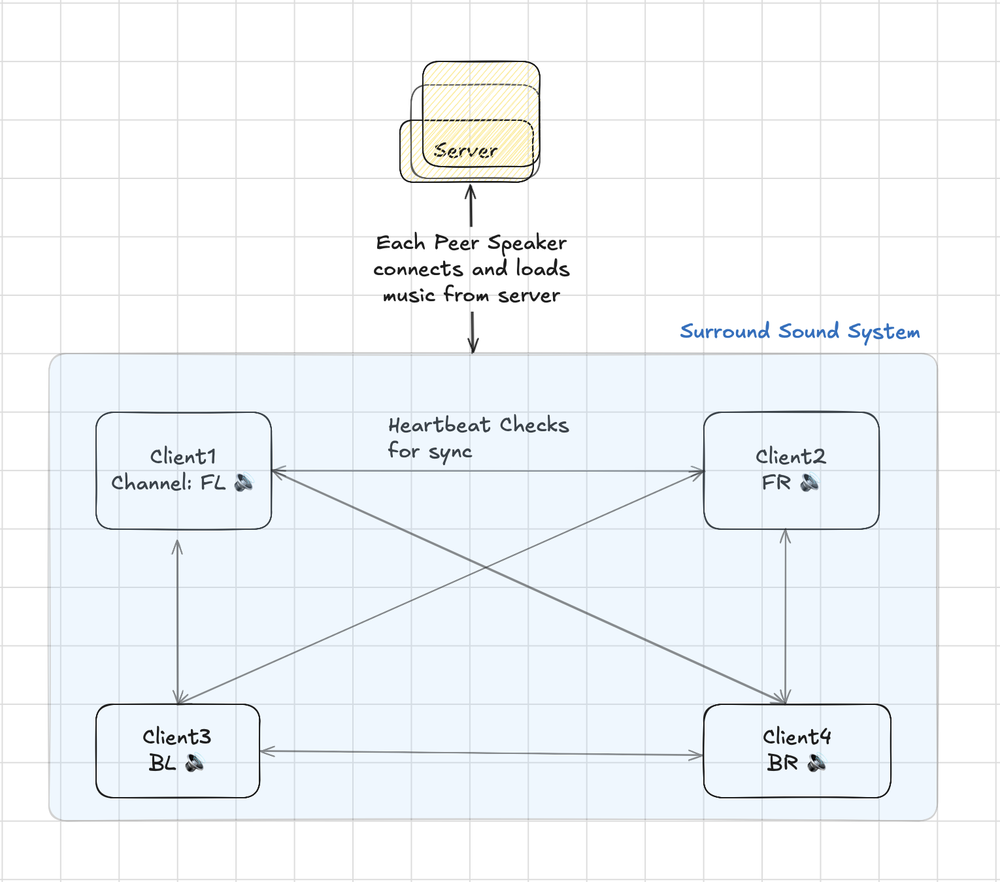

# Distributed Audio Synchronization System

A decentralized, peer-based distributed system where multiple machines can collaborate to play the same audio track in synchronization (e.x. surround sound system, etc.)

## System Architecture



## Principles from Distributed Systems

- Client-server communication using gRPC and Protocol Buffers
- Synchronization using logical clocks (variant of Lamport's algorithm)
- Peer-to-peer consensus network protocol for clients
- Fault tolerance through distributed coordination

## Documentation

This project uses Doxygen to generate API documentation from source code comments.

### Building Documentation

```bash
mkdir -p build && cd build
cmake ..
make docs
```

The generated documentation will be available in `docs/doxygen/html/index.html`.

See [Documentation Guide](docs/README.md) for more information on the documentation system and coding style guides.
